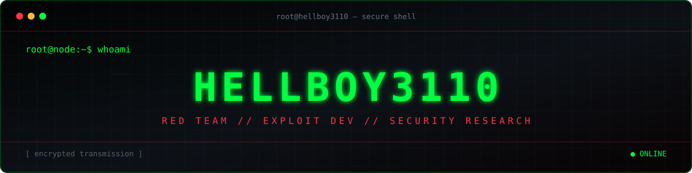

<div align="center">



<br>


<p>
  
  
  
</p>

```text
┌─[ OPERATOR: HELLBOY3110 ]──────────────────────────────────────┐
│  RED TEAM  /  EXPLOIT DEVELOPMENT  /  SECURITY RESEARCH       │
└──────────────────────────────────────────────[ STATUS: ONLINE ]─┘
```

</div>

## `> ./operator --profile`

```yaml
handle: HELLBOY3110
focus:  [red-teaming, exploit-development, security-research]
mode:   "break it ethically → understand it deeply → secure it properly"
status: "building, testing, learning"
```

## `> ls ./arsenal`

<div align="center">


</div>

## `> ./telemetry --live`

<div align="center">


<br>


</div>

## `> tail -f ./activity.log`

<div align="center">

<a href="https://github.com/HELLBOY3110">
  
</a>

</div>

## `> ./deploy-snake --palette neon`

<div align="center">

<picture>
  <source media="(prefers-color-scheme: dark)" srcset="https://raw.githubusercontent.com/HELLBOY3110/HELLBOY3110/output/github-snake-dark.svg" />
  <source media="(prefers-color-scheme: light)" srcset="https://raw.githubusercontent.com/HELLBOY3110/HELLBOY3110/output/github-snake.svg" />
  
</picture>

<sub><code>Automated daily · contribution grid ingestion active</code></sub>

</div>

## `> cat ./disclosure.log`

| Advisory | Target | Class | State | CVSS |
|:--|:--|:--|:--:|:--:|
| [`CVE-2026-16219`](https://www.cve.org/CVERecord?id=CVE-2026-16219) | Croogo CMS ≤ 4.0.7 | Path traversal | `PUBLISHED` | `6.3` |

> [!CAUTION]
> All security research is conducted ethically in authorized, isolated environments.

## `> ./connect --secure`

<div align="center">

[](https://github.com/HELLBOY3110)


<br><br>

```text
root@hellboy3110:~$ exit
Connection closed. Stay off the radar.
```

<sub><code>“In a world of locked doors, the one with the key is king.”</code></sub>

<br><br>


</div>
